# ScaleASAP Backend & Database Architecture

## Table of Contents
1. [System Overview](#system-overview)
2. [Database Schema](#database-schema)
3. [Backend Services Architecture](#backend-services-architecture)
4. [API Design](#api-design)
5. [Data Flows](#data-flows)
6. [AI Pipeline Architecture](#ai-pipeline-architecture)
7. [Security & Authentication](#security--authentication)
8. [Infrastructure](#infrastructure)

---

## System Overview

ScaleASAP is an AI-powered outbound sales platform that automates lead discovery, enrichment, and personalized outreach generation.

### Core Modules
1. **User & Workspace Management** - Multi-tenant workspaces with team collaboration
2. **Discovery Engine** - AI-driven ICP analysis and experiment generation
3. **Lead Engine** - Lead finding, enrichment, and prioritization
4. **Outreach Engine** - Personalized message generation
5. **Campaign Management** - Orchestration and tracking
6. **Analytics & Reporting** - Performance metrics and insights

---

## Database Schema

### Entity Relationship Diagram

```mermaid
erDiagram
    USERS ||--o{ WORKSPACES : owns
    USERS ||--o{ WORKSPACE_MEMBERS : belongs_to
    WORKSPACES ||--o{ WORKSPACE_MEMBERS : has
    WORKSPACES ||--o{ ONBOARDING_DATA : has_one
    WORKSPACES ||--o{ EXPERIMENTS : contains
    WORKSPACES ||--o{ CAMPAIGNS : contains
    WORKSPACES ||--o{ LEADS : contains
    WORKSPACES ||--o{ DISCOVERY_SESSIONS : has
    WORKSPACES ||--o{ DISCOVERY_FEEDBACK : receives
    
    EXPERIMENTS ||--o{ CAMPAIGNS : spawns
    CAMPAIGNS ||--o{ LEADS : targets
    CAMPAIGNS ||--o{ CAMPAIGN_ACTIVITIES : logs
    
    LEADS ||--o{ LEAD_SIGNALS : has
    LEADS ||--o{ LEAD_EXPERIENCE : has
    LEADS ||--o{ OUTREACH_MESSAGES : receives
    LEADS ||--o{ LEAD_OUTCOMES : tracks
    
    USERS {
        uuid id PK
        string email UK
        string encrypted_password
        string full_name
        string avatar_url
        timestamp email_confirmed_at
        timestamp last_sign_in_at
        jsonb metadata
        timestamp created_at
        timestamp updated_at
    }
    
    WORKSPACES {
        uuid id PK
        uuid owner_id FK
        string name
        string website
        string favicon_url
        enum onboarding_status
        jsonb discovery_chat_history
        jsonb settings
        timestamp created_at
        timestamp updated_at
    }
    
    WORKSPACE_MEMBERS {
        uuid id PK
        uuid workspace_id FK
        uuid user_id FK
        enum role
        timestamp invited_at
        timestamp joined_at
        timestamp created_at
    }
    
    ONBOARDING_DATA {
        uuid id PK
        uuid workspace_id FK "unique"
        text trigger_moment
        text founder_role
        text team_size
        text stage
        text[] funding_type
        text funding_amount
        text runway
        text company_name
        text website
        text linkedin
        text twitter
        enum company_type
        text one_liner
        text[] product_categories
        text industry_vertical
        text primary_use_case
        text[] key_features
        text[] integrations
        text pricing_model
        text price_range
        text[] customer_segments
        text[] top_personas
        text[] pain_points
        text[] icp_titles
        text[] icp_industries
        text[] icp_company_sizes
        text[] deal_breakers
        text sales_motion
        text[] lead_sources
        text[] outbound_channels
        text booking_cta
        text calendar_link
        timestamp created_at
        timestamp updated_at
    }
    
    EXPERIMENTS {
        uuid id PK
        uuid workspace_id FK
        string name
        enum type
        text pattern
        jsonb industries
        text pain
        text trigger
        jsonb wiza_filters
        text outreach_angle
        enum status
        int leads_found
        int leads_warming
        int meetings_booked
        timestamp created_at
        timestamp updated_at
    }
    
    CAMPAIGNS {
        uuid id PK
        uuid workspace_id FK
        uuid experiment_id FK
        string name
        enum status
        jsonb settings
        int daily_lead_limit
        boolean autopilot_enabled
        timestamp last_discovery_run
        timestamp next_discovery_run
        timestamp created_at
        timestamp updated_at
        timestamp deleted_at
    }
    
    CAMPAIGN_ACTIVITIES {
        uuid id PK
        uuid campaign_id FK
        enum activity_type
        string title
        text description
        jsonb metadata
        enum status
        timestamp created_at
    }
    
    LEADS {
        uuid id PK
        uuid campaign_id FK
        uuid workspace_id FK
        string full_name
        string job_title
        string company
        string linkedin_url
        string email
        string phone
        string location
        string avatar_url
        text ai_summary
        int relevance_score
        enum status
        enum outcome
        text outcome_reason
        jsonb raw_data
        timestamp contacted_at
        timestamp responded_at
        timestamp created_at
        timestamp updated_at
    }
    
    LEAD_SIGNALS {
        uuid id PK
        uuid lead_id FK
        string headline
        text description
        enum signal_type
        int strength_score
        jsonb citations
        timestamp detected_at
        timestamp created_at
    }
    
    LEAD_EXPERIENCE {
        uuid id PK
        uuid lead_id FK
        string company_name
        string company_logo_url
        string title
        text description
        string time_from
        string time_to
        boolean is_current
        int sort_order
        timestamp created_at
    }
    
    OUTREACH_MESSAGES {
        uuid id PK
        uuid lead_id FK
        uuid campaign_id FK
        enum format
        boolean is_followup
        int sequence_number
        text content
        text subject
        enum status
        timestamp scheduled_at
        timestamp sent_at
        timestamp opened_at
        timestamp replied_at
        timestamp created_at
        timestamp updated_at
    }
    
    LEAD_OUTCOMES {
        uuid id PK
        uuid lead_id FK
        uuid logged_by FK
        enum outcome
        text reason
        text notes
        jsonb metadata
        timestamp created_at
    }
    
    DISCOVERY_SESSIONS {
        uuid id PK
        uuid workspace_id FK
        jsonb messages
        jsonb generated_icps
        enum status
        timestamp created_at
        timestamp updated_at
    }
    
    DISCOVERY_FEEDBACK {
        uuid id PK
        uuid workspace_id FK
        uuid user_id FK
        int rating
        text feedback
        jsonb experiment_context
        timestamp created_at
    }
```

### Enum Definitions

```mermaid
classDiagram
    class OnboardingStatus {
        incomplete
        complete
    }
    
    class WorkspaceMemberRole {
        owner
        admin
        member
        viewer
    }
    
    class ExperimentType {
        bullseye
        variable_a
        variable_b
        contrarian
        long_shot
    }
    
    class ExperimentStatus {
        pending
        creating_hypotheses
        finding_leads
        prioritizing_leads
        warmup_initiated
        complete
        failed
    }
    
    class CampaignStatus {
        active
        paused
        completed
        archived
    }
    
    class LeadStatus {
        found
        enriching
        enriched
        drafted
        queued
        sent
        responded
    }
    
    class LeadOutcome {
        no_response
        interested
        meeting_booked
        meeting_done
        closed_won
        closed_lost
        rejected
        unqualified
    }
    
    class SignalType {
        funding
        hiring
        expansion
        product_launch
        partnership
        leadership_change
        news_mention
        social_activity
    }
    
    class OutreachFormat {
        linkedin_connection
        linkedin_message
        linkedin_inmail
        email_cold
        email_warm
    }
    
    class OutreachStatus {
        draft
        scheduled
        sent
        delivered
        opened
        clicked
        replied
        bounced
        failed
    }
    
    class ActivityType {
        campaign_created
        discovery_started
        discovery_completed
        leads_found
        leads_enriched
        outreach_generated
        lead_contacted
        lead_responded
        meeting_booked
        campaign_paused
        campaign_resumed
        error_occurred
    }
```

---

## Backend Services Architecture

### Microservices Overview

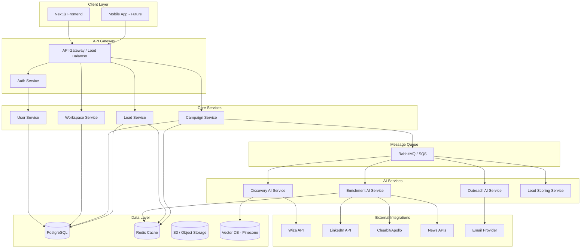

### Service Responsibilities

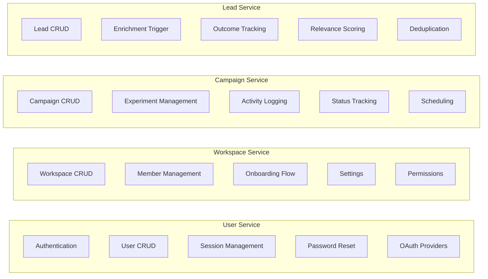

---

## API Design

### Unified API Endpoints

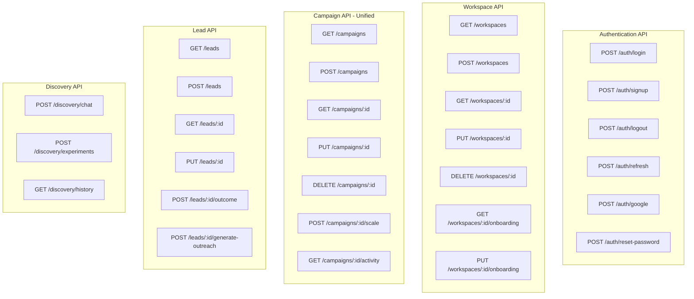

### Campaign API Response Structure

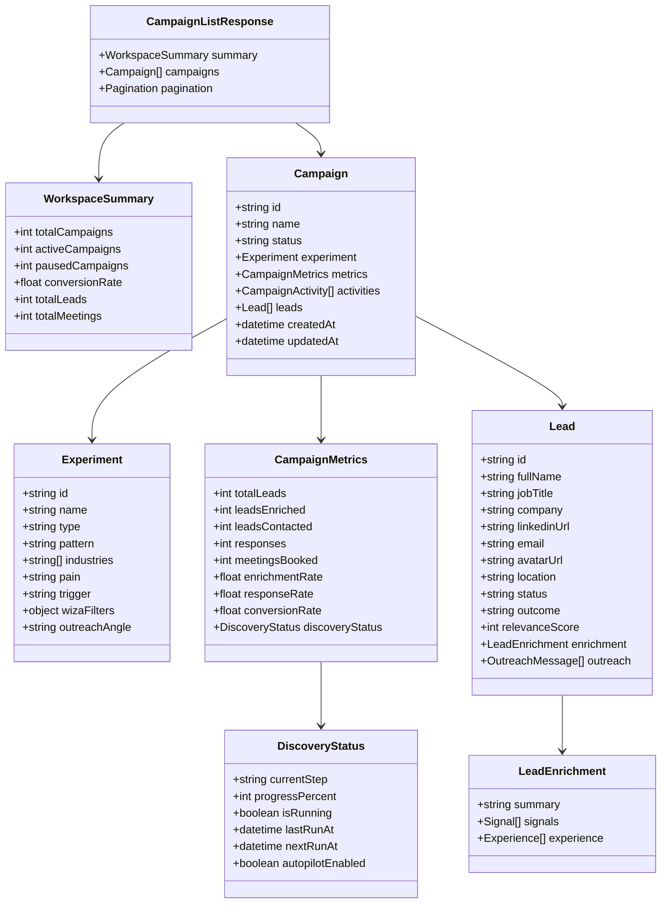

---

## Data Flows

### Campaign Creation Flow

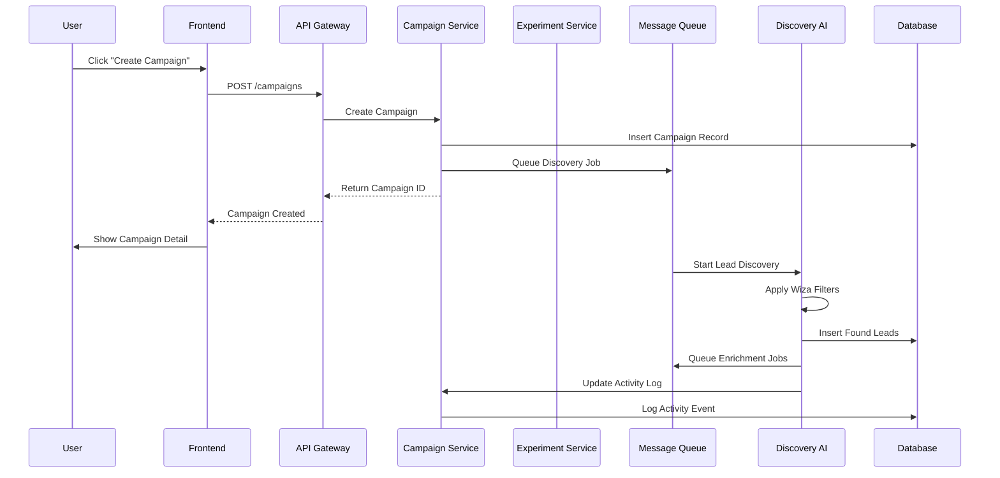

### Lead Enrichment Flow

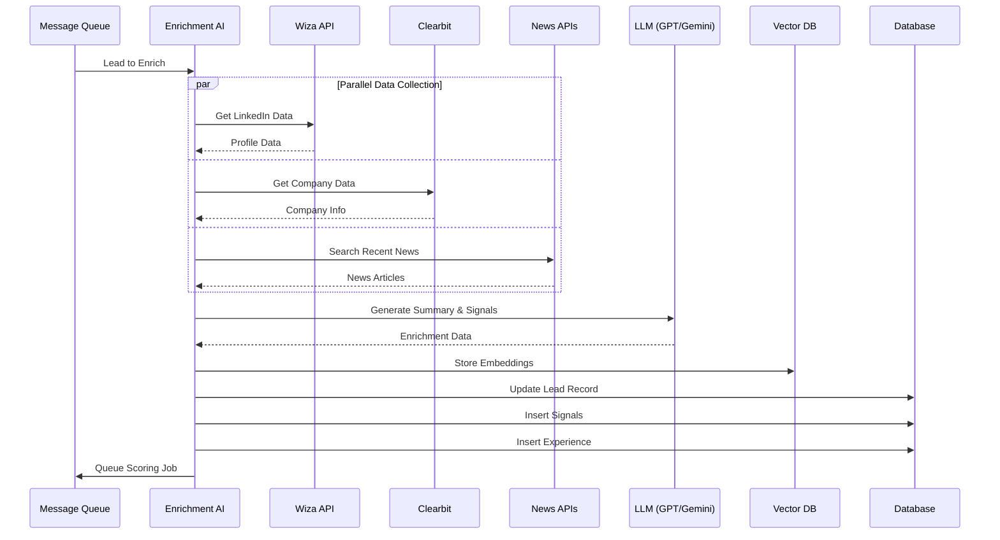

### Outreach Generation Flow

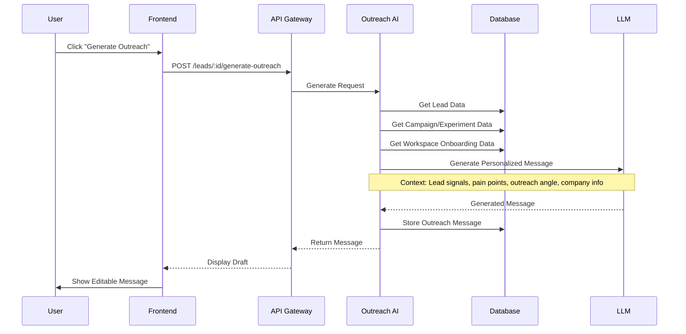

### Real-time Activity Updates

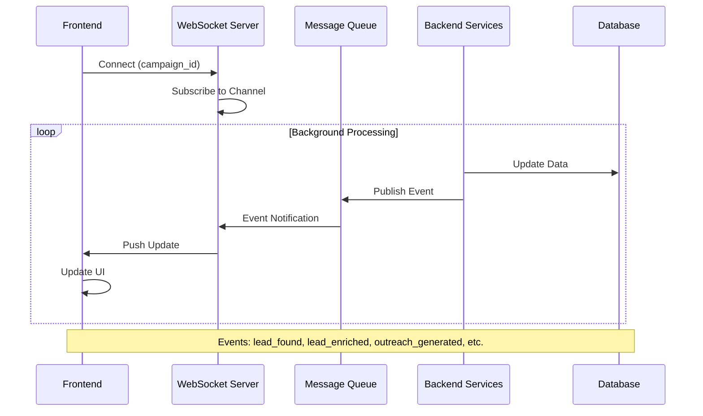

---

## AI Pipeline Architecture

### Discovery AI Pipeline

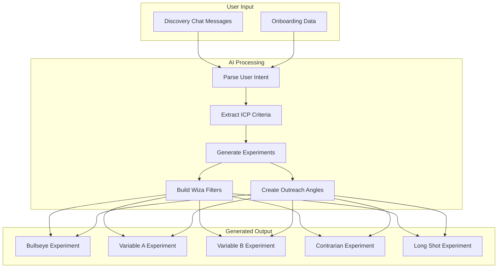

### Lead Scoring Pipeline

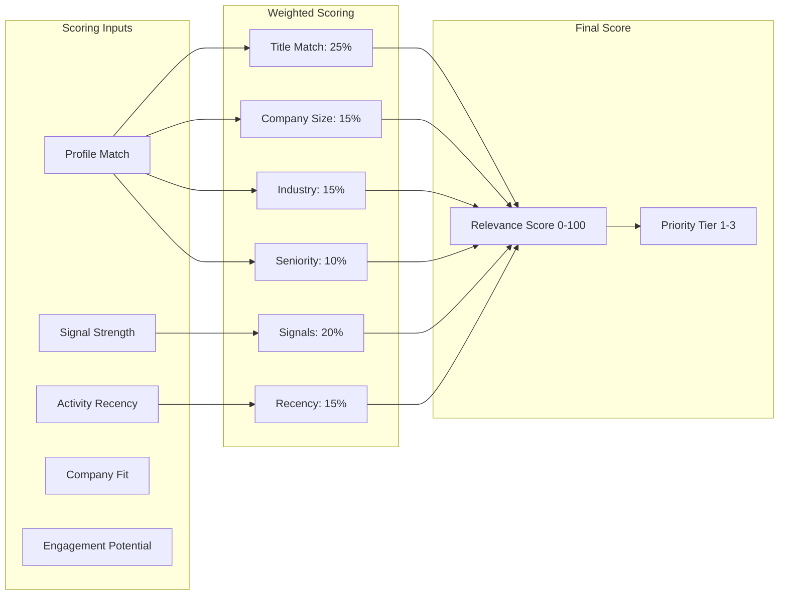

---

## Security & Authentication

### Auth Flow

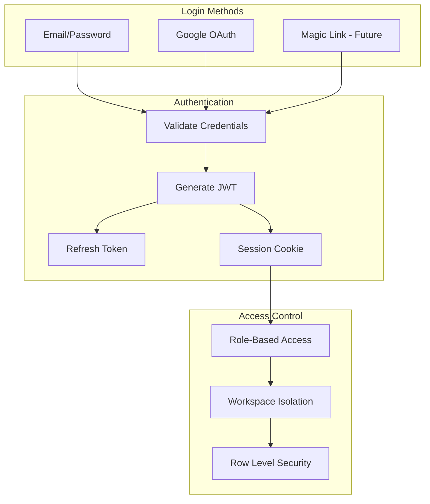

### Permission Matrix

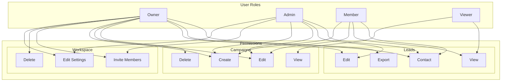

---

## Infrastructure

### Deployment Architecture

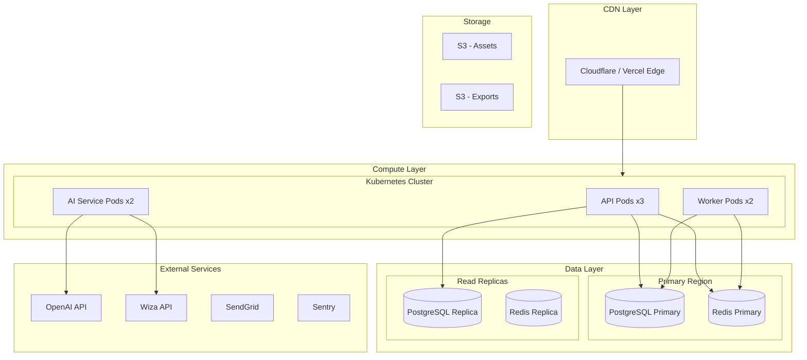

### Monitoring & Observability

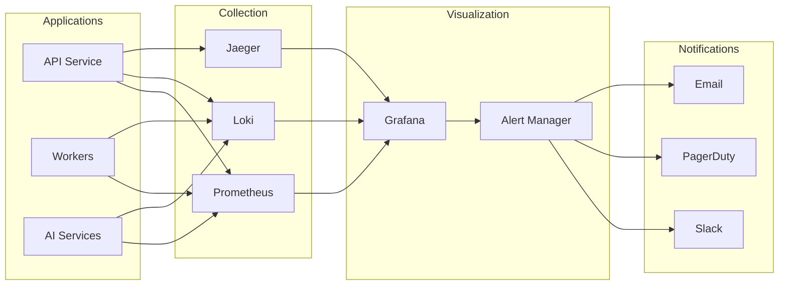

---

## Implementation Phases

### Phase 1: Core MVP
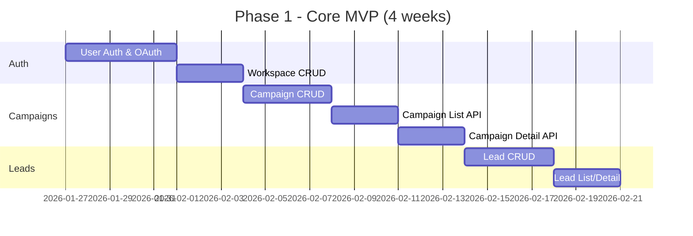

### Phase 2: AI Integration
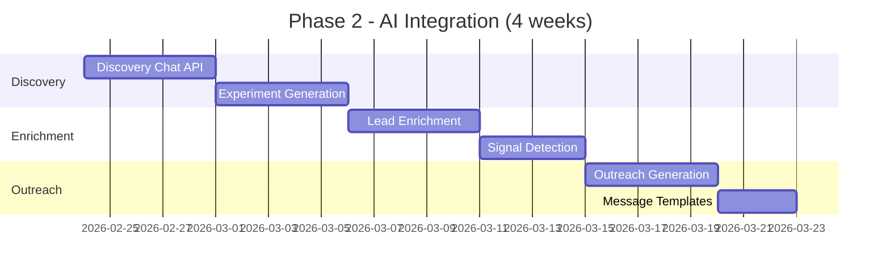

### Phase 3: Advanced Features
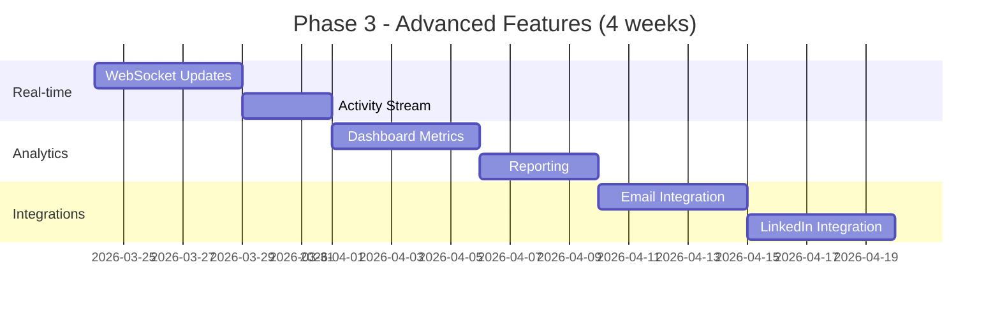

---

## Technology Stack Recommendations

| Layer | Technology | Rationale |
|-------|------------|-----------|
| **API Framework** | FastAPI (Python) or NestJS (Node) | Async support, OpenAPI docs, type safety |
| **Database** | PostgreSQL 15+ | JSONB support, RLS, full-text search |
| **Cache** | Redis 7+ | Session storage, rate limiting, pub/sub |
| **Queue** | RabbitMQ or AWS SQS | Reliable message delivery, dead letter queues |
| **AI/LLM** | OpenAI GPT-4 + Gemini | Quality, speed, fallback options |
| **Vector DB** | Pinecone or pgvector | Semantic search, similarity matching |
| **Object Storage** | AWS S3 or R2 | Exports, attachments, assets |
| **Auth** | Supabase Auth or Auth0 | OAuth providers, JWT, session management |
| **Monitoring** | Prometheus + Grafana | Metrics, alerting, dashboards |
| **Logging** | Loki or ELK Stack | Centralized logging, search |
| **Error Tracking** | Sentry | Exception tracking, performance |
| **CI/CD** | GitHub Actions | Automated testing, deployment |
| **Hosting** | AWS ECS or Kubernetes | Container orchestration, scaling |

---

## Summary

This architecture supports:
- ✅ Multi-tenant workspaces with proper isolation
- ✅ Unified API endpoints for frontend efficiency
- ✅ Scalable AI pipelines for lead discovery & enrichment
- ✅ Real-time updates via WebSocket
- ✅ Proper security with RBAC and RLS
- ✅ Observable and monitorable services
- ✅ Phased implementation approach
